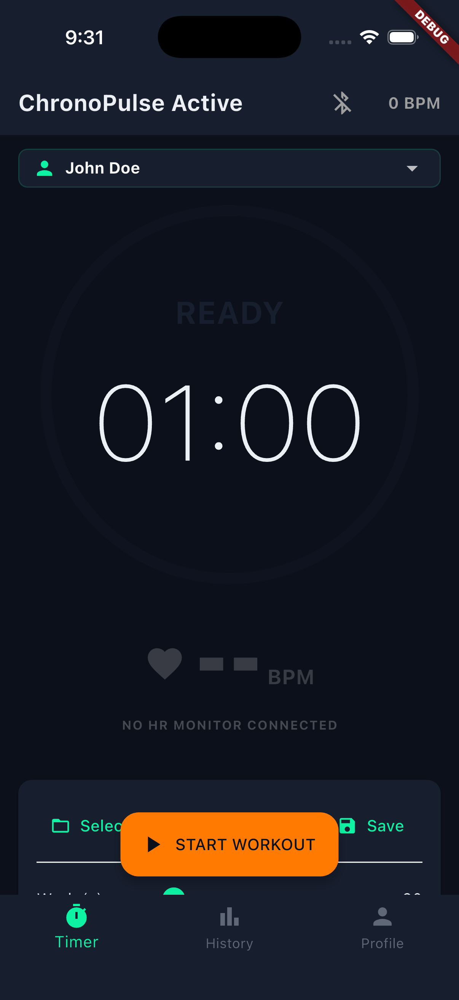
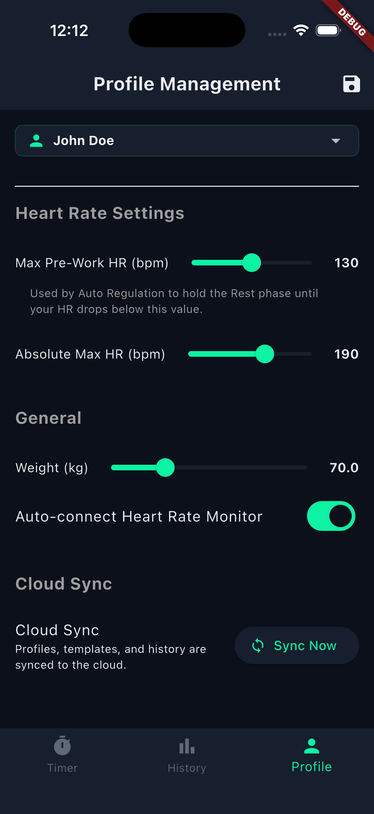
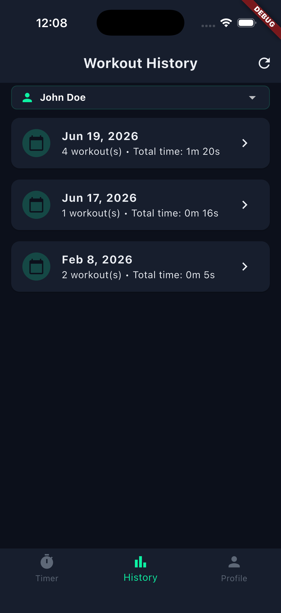
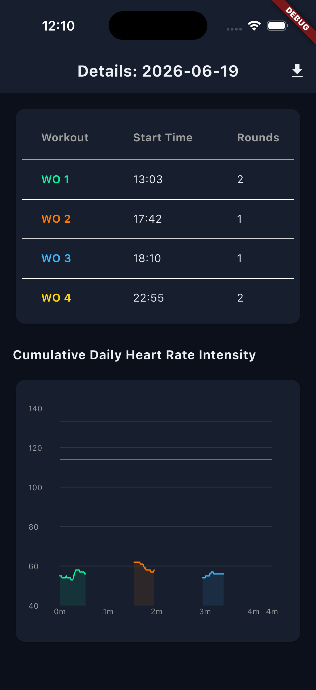
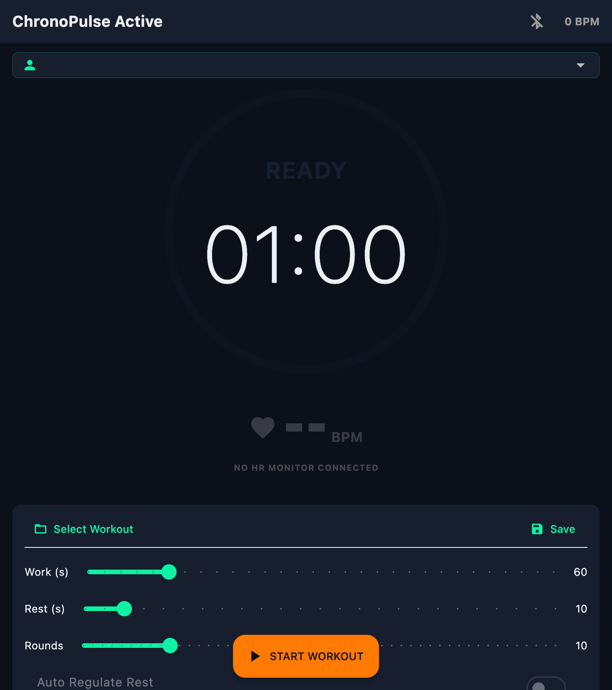
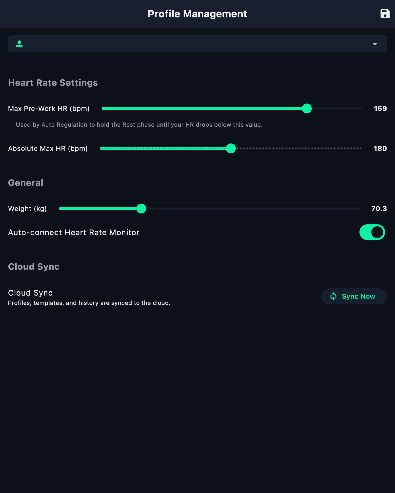
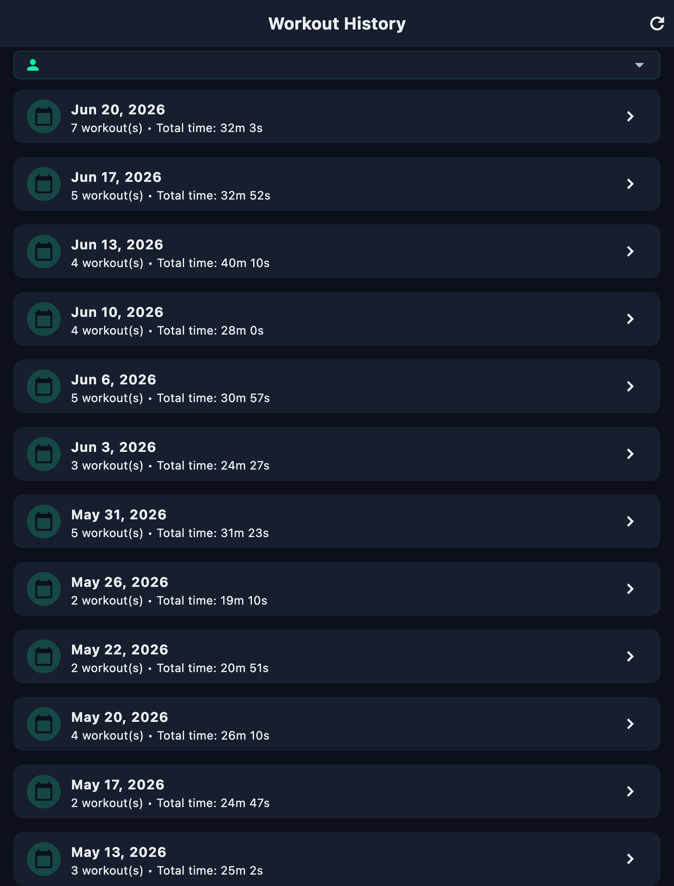
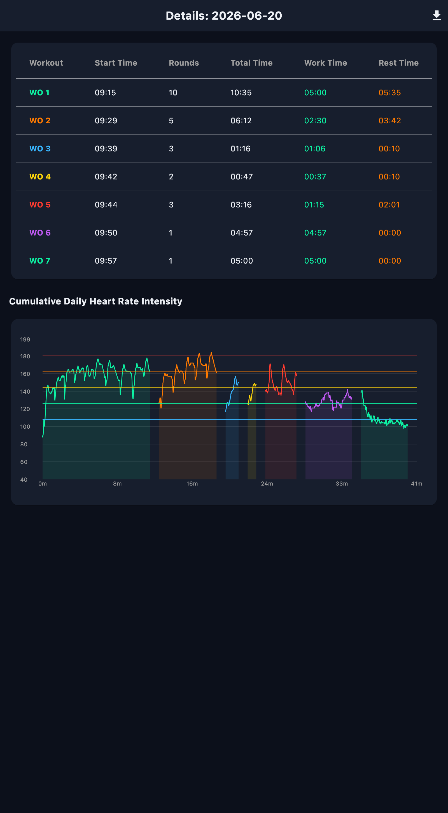

# ChronoPulse Active (EMOM Workout Timer)

ChronoPulse Active is a sleek, modern Flutter-based EMOM (Every Minute on the Minute) workout timer designed for iOS and Android. This mobile app serves as the mobile companion to the ChronoPulse macOS desktop client, syncing seamlessly via Firebase Firestore. It features local SQLite caching, real-time Bluetooth LE heart rate monitoring, adaptive auto-regulation, and high-visibility zone training.

## 📸 Screenshots

### iPhone Companion App (Flutter)
<p align="center">
  
  &nbsp;
  
  &nbsp;
  
</p>
<p align="center">
  
  &nbsp; &nbsp;
  
</p>

### macOS Desktop App (Flutter)
<p align="center">
  
  &nbsp;
  
</p>
<p align="center">
  
  &nbsp;
  
</p>

---

## 📱 Features

### ⏱️ Advanced Workout Timer
- **Flexible Configuration**: Set your **Total Rounds**, **Work Duration**, and **Rest Duration** for custom workouts.
- **Workout Templates**: Save named workout settings (rounds, work/rest, default notes) locally and sync them to load with a single tap.
- **Continuous Mode**: Run your workout continuously with manual stopping and lap tracking.
- **Smart Wakelock**: Integrated screen sleep prevention keeps the screen active and visible throughout your training session.

### ❤️ Heart Rate Intelligence & Zone Training
- **Bluetooth LE Integration**: Connect standard heart rate monitors (e.g., Polar H10, Garmin, etc.) with automatic background scanning and reconnection.
- **High-Visibility HUD**: Large heart rate and zone indicator (Zone 1 to 5) styled with a pulsing neon micro-animation for quick glance updates during high-intensity intervals.
- **Auto-Regulation (Smart Rest)**: Pause and hold the rest phase countdown if your heart rate is above your profile's configured threshold, ensuring you recovery before the next round begins.
- **Calorie Estimation**: Dynamic real-time calorie burn tracking using sex, age, weight, and average heart rate intensity.

### 🔄 Bidirectional Firebase Sync
- **Local SQLite Cache**: Workouts are logged first to local SQLite databases using cross-platform `sqflite` (with FFI support).
- **Background Sync**: Silent, anonymous authentication syncing profiles, workout templates, and detailed logs automatically to Cloud Firestore.
- **Resilient Offline Work**: Perform workouts offline and sync changes immediately once internet connection is restored.
- **Notes Editor**: Tap notes in the workout history list to edit them. Edits update the local database and synchronize automatically to Firebase.

### 📊 History & Analytics
- **Stacked Progress Graph**: A 7-day visual history chart detailing daily completed workouts.
- **Nord-Themed Intensity Zones**: Line charts visualize heart rate curves mapped directly to your training zones.
- **CSV Exporter**: Single-tap export of the day's workouts directly to your device storage in a clean, standard CSV format.

---

## 🛠️ codebase Architecture

The application is structured logically to separate presentation, data management, and state logic:

```text
lib/
├── main.dart                 # App setup, Firebase/SQLite initialization, and tab view routing
├── firebase_options.dart     # Auto-generated Firebase configuration values
├── models/
│   └── workout_engine.dart   # Core workout state machine (PREP, WORK, REST, HOLD, FINISHED)
├── screens/
│   ├── timer_screen.dart     # Workout configuration, live HUD, and template controls
│   ├── history_screen.dart   # List of workout records and weekly progress bar chart
│   ├── details_screen.dart   # Workout results table, notes editor, and heart rate line graph
│   └── profile_screen.dart   # Multi-user profile management, target limits, and sync control
└── services/
    ├── database_helper.dart  # Local SQLite database configurations and CRUD queries
    └── sync_service.dart     # Silent anonymous auth and Firestore sync worker
```

---

## 🚀 Getting Started

### Prerequisites
- **Flutter SDK**: `>=3.0.0`
- **CocoaPods** (for iOS builds)
- A **Firebase Project** with Firestore and Anonymous Authentication enabled.

### Setup and Running

1. **Install Dependencies**:
   ```bash
   flutter pub get
   ```

2. **Run Code Generation** (if launcher icons or dependencies change):
   ```bash
   flutter pub run flutter_launcher_icons
   ```

3. **Configure Firebase**:
   - For iOS: Place your `GoogleService-Info.plist` in the `ios/Runner` folder and link it via Xcode.
   - For Android: Place your `google-services.json` in `android/app`.

4. **Launch the Application**:
   - To launch on an emulator or connected device:
     ```bash
     flutter run
     ```
   - To build for an iOS Simulator:
     ```bash
     flutter build ios --no-codesign --simulator
     ```

### 🧪 Running Tests
The project features automated engine logic and auto-regulation unit tests:
```bash
flutter test
```

---

## 💾 Local & Remote Schema

### SQLite Cache
- **`profiles`**: User metadata, weight presets, and default sync settings.
- **`workout_templates`**: Name, rounds, work time, rest time, and template notes.
- **`workouts`**: End time, rounds completed, work/rest settings, calories, notes.
- **`heart_rate_logs`**: Chronological heartbeat records linked to workouts for graphic plotting.

### Firestore Collections
- **`/profiles/{name}`**: Holds profile presets.
- **`/templates/{profile_name_template_name}`**: Stores template data.
- **`/workouts/{profile_name_start_time}`**: Stores workout summary statistics along with the nested `hr_details` map containing all heart rate logs.
